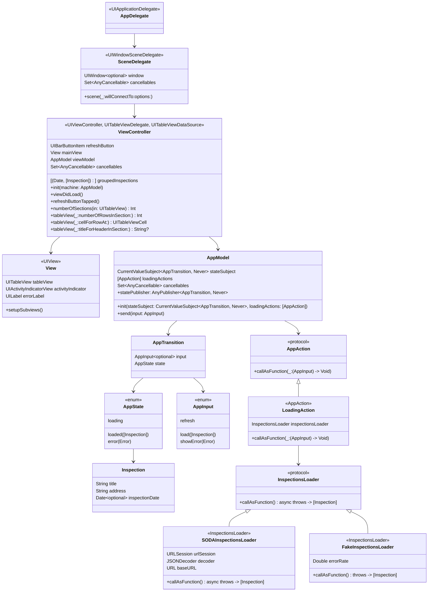
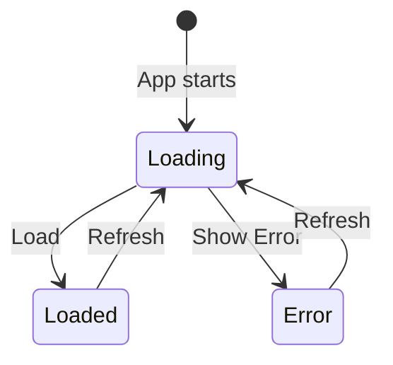
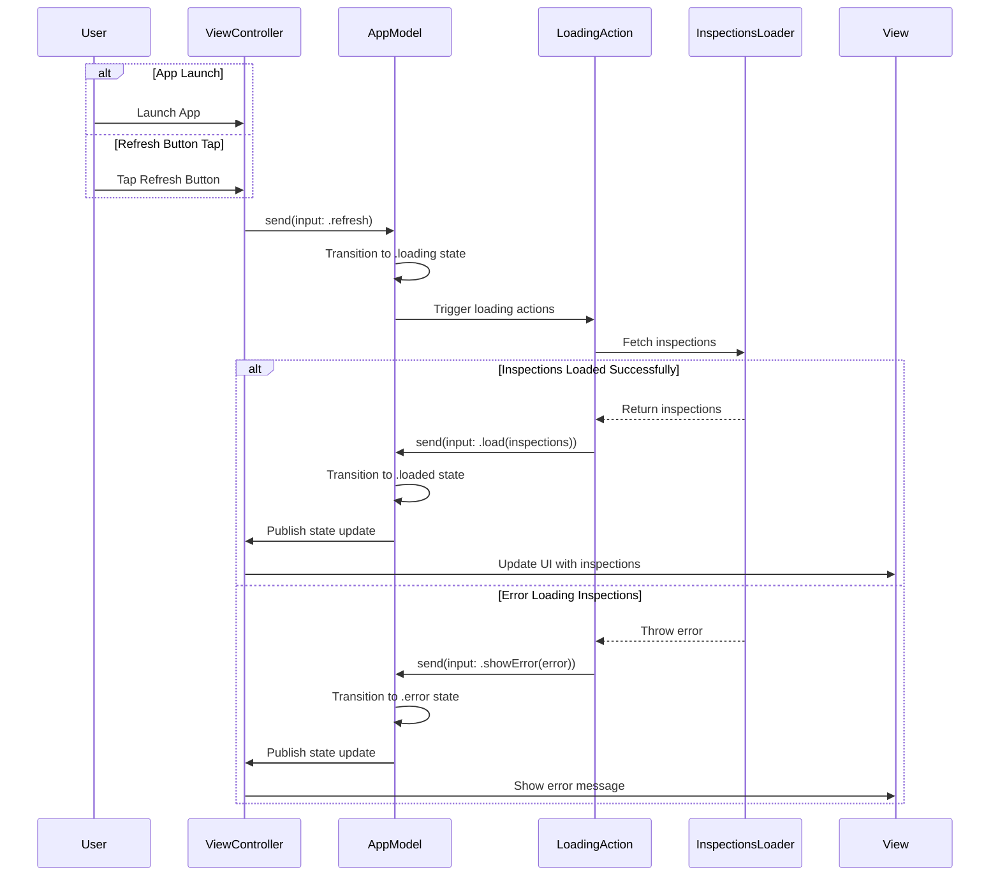

# Chicago Food Inspections

## Class Diagram

```mermaid
classDiagram
    class AppDelegate {
        <<UIApplicationDelegate>>
    }

    class SceneDelegate {
        <<UIWindowSceneDelegate>>
        UIWindow~optional~ window
        Set~AnyCancellable~ cancellables
        +scene(_:willConnectTo:options:)
    }

    class ViewController {
        <<UIViewController, UITableViewDelegate, UITableViewDataSource>>
        UIBarButtonItem refreshButton
        View mainView
        AppModel viewModel
        [(Date, [Inspection])] groupedInspections
        Set~AnyCancellable~ cancellables
        +init(machine: AppModel)
        +viewDidLoad()
        +refreshButtonTapped()
        +numberOfSections(in: UITableView) Int
        +tableView(_:numberOfRowsInSection:) Int
        +tableView(_:cellForRowAt:) UITableViewCell
        +tableView(_:titleForHeaderInSection:) String?
    }

    class View {
        <<UIView>>
        UITableView tableView
        UIActivityIndicatorView activityIndicator
        UILabel errorLabel
        +setupSubviews()
    }

    class AppModel {
        CurrentValueSubject~AppTransition, Never~ stateSubject
        [AppAction] loadingActions
        Set~AnyCancellable~ cancellables
        +statePublisher: AnyPublisher~AppTransition, Never~
        +init(stateSubject: CurrentValueSubject~AppTransition, Never~, loadingActions: [AppAction])
        +send(input: AppInput)
    }

    class AppTransition {
        AppInput~optional~ input
        AppState state
    }

    class AppState {
        <<enum>>
        loading
        loaded([Inspection])
        error(Error)
    }

    class AppInput {
        <<enum>>
        load([Inspection])
        showError(Error)
        refresh
    }

    class Inspection {
        String title
        String address
        Date~optional~ inspectionDate
    }

    class AppAction {
        <<protocol>>
        +callAsFunction(_: (AppInput) -> Void)
    }

    class LoadingAction {
        <<AppAction>>
        InspectionsLoader inspectionsLoader
        +callAsFunction(_: (AppInput) -> Void)
    }

    class InspectionsLoader {
        <<protocol>>
        +callAsFunction() async throws -> [Inspection]
    }

    class SODAInspectionsLoader {
        <<InspectionsLoader>>
        URLSession urlSession
        JSONDecoder decoder
        URL baseURL
        +callAsFunction() async throws -> [Inspection]
    }

    class FakeInspectionsLoader {
        <<InspectionsLoader>>
        Double errorRate
        +callAsFunction() throws -> [Inspection]
    }

    AppDelegate --> SceneDelegate
    SceneDelegate --> ViewController
    ViewController --> View
    ViewController --> AppModel
    AppModel --> AppTransition
    AppTransition --> AppInput
    AppTransition --> AppState
    AppState --> Inspection
    AppModel --> AppAction
    AppAction <|-- LoadingAction
    LoadingAction --> InspectionsLoader
    InspectionsLoader <|-- SODAInspectionsLoader
    InspectionsLoader <|-- FakeInspectionsLoader
```

## State Diagram

```mermaid
stateDiagram-v2
    [*] --> Loading : App starts
    Loading --> Loaded : Load
    Loading --> Error : Show Error
    Loaded --> Loading : Refresh
    Error --> Loading : Refresh
```

## Sequence Diagram

```mermaid
sequenceDiagram
    participant User
    participant ViewController
    participant AppModel
    participant LoadingAction
    participant InspectionsLoader

    alt App Launch
        User->>ViewController: Launch App
    else Refresh Button Tap
        User->>ViewController: Tap Refresh Button
    end
    ViewController->>AppModel: send(input: .refresh)
    AppModel->>AppModel: Transition to .loading state
    AppModel->>LoadingAction: Trigger loading actions
    LoadingAction->>InspectionsLoader: Fetch inspections

    alt Inspections Loaded Successfully
        InspectionsLoader-->>LoadingAction: Return inspections
        LoadingAction->>AppModel: send(input: .load(inspections))
        AppModel->>AppModel: Transition to .loaded state
        AppModel->>ViewController: Publish state update
        ViewController->>View: Update UI with inspections
    else Error Loading Inspections
        InspectionsLoader-->>LoadingAction: Throw error
        LoadingAction->>AppModel: send(input: .showError(error))
        AppModel->>AppModel: Transition to .error state
        AppModel->>ViewController: Publish state update
        ViewController->>View: Show error message
    end
```
